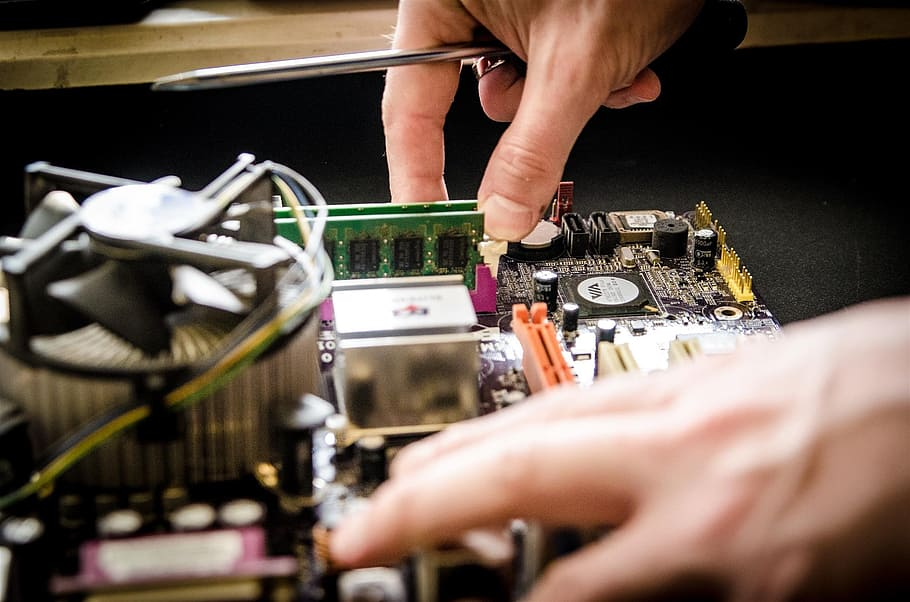

## welcome to my new profile website

## my profile website is mainly divided of 3 sections

1. index.html (which is my main profile home page)
2. gallery.html (which is my photo gallery page)
3. contact.html (which is where to contact me page)

## I created css file for every page and linked them.

## In index.html file i add the following:

1. In the header i created a Navigation bar with logo using the following code:
<header>
        
        <nav>
            <ul>
             <li>
             <a href="./index.html">Profile</a>
             </li>
             <li>
             <a href="./gallery.html">Gallery</a>
             </li>
             <li>
             <a href="./contact.html">Contact</a>
             </li>
            </ul>
        </nav>
</header>

2. In the body i add my profile photo and information about me and i add icons to my information using the following website:
   (https://fontawesome.com/)

3. I add hover effect to my navigation bar using the following code add in my index.css file:

nav a:hover {
background-color: goldenrod;
color: black;
}

@keyframes slideFromRight {
0% {
transform: translate(20%);
}
50% {
transform: translate(-200%);
}
}

4. I add the following code to my index.css file to let the navigation bar sticked 100% on the top of my page with no blanks:

html {
scroll-padding-top: 100px;
}

## In image.html file i added the following :

1. add photo gallery using the following code:

<section id="gallery">
           

              
              
              
           

           

            
            

            
           

           

            
            
            
           

      </section>

2. I give it animation effect using the following code in images.css file:

@keyframes pop {
0% {
transform: scale(1) rotate(0deg);
}

    50% {
        transform: scale(0.8) rotate(-180deg);
    }

    100% {
        transform: scale(1.2) rotate(360deg);
    }

}

#gallery img:hover {
animation: pop 0.5s forwards;
box-shadow: 5px 5px 5px goldenrod;
}

## In contact.html file i added the following :

## I create a section with 2 divisions 1st for social media and 2nd for contacting form by using the following code:

1. social media code:
   

   <article>
   <h2><i class="fa-solid fa-earth-americas fa-2xl" style="color: #ffffff;"></i> Social Media</h2>
   
<i class="fa-brands fa-facebook fa-lg" style="color: white"></i> Facebook

   
<i class="fa-brands fa-square-twitter fa-lg" style="color: white;"></i> Twitter

   
<i class="fa-brands fa-instagram fa-lg" style="color: white;"></i> Instagram

   
<i class="fa-brands fa-linkedin fa-lg" style="color: white;"></i> Linkedin

   
<i class="fa-brands fa-discord fa-lg" style="color: white;"></i> Discord

   </article>
   

2. contact form code:
<form>

<label for="name">Name:</label>
<input type="text" id="name" name="name" required>

<label for="email">Email:</label>
<input type="email" id="email" name="email" required>

<label for="subject">Subject:</label>
<input type="text" id="subject" name="subject" required>

<label for="message">Message:</label>
<textarea type="message" name="message" rows="5" cols="30" required></textarea>  
 

<input type="submit" value="Send Message">

</form>

<!-- action="submit.php" method="POST" to add after form as id to activate submit later-->
